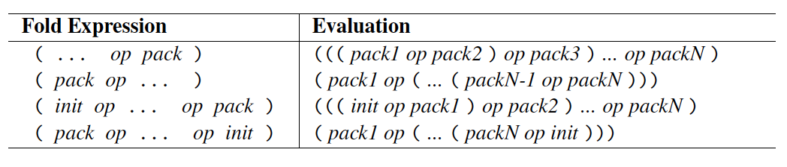

# Variadic Templates (C++11)
Since C++11, templates can accept variable number of template arguments, allowing use of arbitrary number of arguments, of arbitrary types. This can allow applications to pass arbitary number of arbitrary type in a class, or to provide generic code to process any number of parameters of any type.

Arguments to variadic templates apply the same rule as ordinary parameters. If passed by value, arguments copied and decay (e.g. arrays become pointers), else if passed by reference, parameter refers to original parameter and don't decay.
```cpp
// arg are copies, decayed type :
template<typename... Args>
void foo(Args... args);
// args are nondecayed reference to passed objects :
template<typename... Args>
void bar(Args const&... Args)
```

## Examples
Calling `print()` for variable number of arguments, different types:
```cpp
#include <iostream>

void print() {}

template<typename T, typename... Types>
void print(T firstArg, Types... args) {
    std::cout << firstArg << '\n'; // print first argument
    print(args...); // print remaining arguments recursively
}
```

With one or more arguments, function template is used, printing first argument and remaining arguments recursively. The remaining arguments `Types... args` are a function parameter pack.
<br>
To end the recursion, nontemplate overload of `print()` is provided, issued when parameter pack is empty (`print(args...)` where args is empty, do nothing). Example call :

```cpp
std::string s("world");
// print<double, char const *, std::string> (7.5, "hello", s);
//  -> std::cout << 7.5;
//  -> print<char const*, std::string> ("hello", s);
//      -> std::cout << "hello";
//      -> print<std::string> (s);
//          -> std::cout << s;
//          -> print() -> nontemplate print() is used, do nothing
print(7.5, "hello", s); 
/* 
    Outputs : 
    7.5
    hello
    world 
*/
```

## Overloading Variadic and Nonvariadic Templates
Above can also be implemented as follows :
```cpp
template<typename T>
void print(T arg) {
    std::cout << arg << '\n';
}

template<typename T, typename... Types>
void print(T firstArg, Types... args){
    print(firstArg); // call nonvariadic print for first argument
    print(args...);  // call print for remaining arguments
}
```
If two function templates only differ by trailing parameter pack, function template without trailing parameter pack is preferred.

## Operator sizeof...
C++11 has sizeof operator for variadic templates, `sizeof...`, which expands to number of elements the pack contains.
```cpp
template<typename T, typename... Types>
void print(T firstArg, Types... args){
    // both print number of remaining arguments
    std::cout << sizeof...(Types) << '\n'; // print number of remaining types
    std::cout << sizeof...(args) << '\n'; // print number of remaining args
}
```
At first, this seems like it would work : 
```cpp
template<typename T, typename... Types>
void print(T firstArg, Types... args){
    std::cout << firstArg << '\n';
    if (sizeof...(args) > 0){ // error if sizeof...(args) == 0
        print(args...); // since no print() defined for empty args...
    }
}
```
This will not work, because with `if`, both branches of if statement will instantiate the function template. Whether the instantiated code is useful is runtime decision, but template instantiation is compile time decision. When the `print()` is called with 1 argument, the statement `print(args...)` is still instantiated with no argument, but no `print()` is provided, hence error. However, this can be achieved with compile time if.

## Fold expressions
Since C++17, we can compute result of binary operator over all arguments of a parameter pack (with optional initial value).
Example function returning sum of all arguments : 
```cpp
template<typename... T>
auto foldSum(T... s){
    return (... + s); // ((s1 + s2) + s3) + ...
}

template<typename... Args>
bool allTrue(Args... args) {
    return (... && args); // true if all args are true
}

allTrue(true, true, false); // false

```
If parameter pack is empty, expression is ill formed, except `operator&&` value `true`, and `operator||` is `false`, comma operator value for empty pack is `void()`. 



We can even traverse a binary tree using `operator->*` (wew) :
```cpp
struct Node {
    int value;
    Node* left;
    Node* right;
    Node (int i = 0) : value(i), left(nullptr), right(nullptr) {}
};

// Type is Node* Node::* (A pointer to a member of class Node whose type is Node*)
auto left = &Node::left;
auto right = &Node::right;

template<typename T, typename... TP>
Node* traverse(T np, TP... paths) {
    // np ->* paths1 ->* paths2 ->* ...
    return (np ->* ... ->* paths);
}

int main() {
    Node* root = new Node{0};
    root->left = new Node{1};
    root->left->right = new Node{2};
    root->right = new Node(3);

    // we are telling to go left then right from root
    Node* node = traverse(root, left, right);
    // go right once
    Node* node2 = traverse(root, right);
}
```

Other example, to print arguments, we might think to simplify :
```cpp
// Without whitespace
template<typename... Types>
void print(Types const&... args){
    (std::cout << ... << args) << '\n';
}
```

But, to print arguments with whitespace, we need our own class :
```cpp
template<typename T>
class AddSpace {
private:
    T const& ref;
public:
    AddSpace(T const& r) : ref(r) {}
    friend std::ostream& operator<< (std::ostream& os, AddSpace<T> s) {
        return os << s.ref << ' '; // pass argument and space
    }
};

template<typename... Args>
void print(Args... args){
    // uses argument deduction of AddSpace<Args>
    (std::cout << ... << AddSpace(args)) << '\n';
}
```

## Applications
Variadic templates are used a lot in implementing generic libraries. Example in C++ Standard Library :
```cpp
// make shared ptr to complex<float>, use variadic arg to initialize the complex
auto sharedPtr = std::make_shared<std::complex<float>>(4.2, 6.1);
// pass arguments to thread
std::thread t(foo, 42, "hello"); 
// Emplace back in vector
std::vector<Customer> v;
v.emplace("Tim", "Jovi", 1962); // call Customer constructor, initialized by variadic arg here
```

The arguments are `perfectly forwarded` with move semantics :
```cpp
namespace std {
    template<typename T, typename... Args> shared_ptr<T>
    make_shared(Args&&... args);

    class thread {
    public:
        template<typename F, typename... Args>
        explicit thread(F&& f, Args&&... args);
        ...
    };

    template<typename T, typename Allocator = allocator<T>>
    class vector {
    public:
        template<typename... Args> reference emplace_back(Args&&... args);
        ...
    };
}
```

## Variadic Class Templates and Variadic Expressions
Variadic parameter packs can appear in many places, including expressions, class templates, using declarations, and deduction guides.
### Variadic Expressions
We can compute with the parameters, double the parameter on pack args, e.g :
```cpp
template<typename T>
void printDoubled(T const&... args){
    print(args + args...);
}
// same as : print(7.5 + 7.5, 
//              std::string("hello") + std::string("hello"),
//              std::complex<float>(4, 2) + std::complex<float>(4, 2));
printDoubled(7.5, std::string("hello"), std::complex<float>(4, 2));
```

To add 1 to each argument : 
```cpp
template<typename T>
void addOne(T const&... args){
    print(args + 1...); // Error, 1... has too many decimal places
    print(args + 1 ...); // ok
    print((args + 1)...); // ok
}
```

With compile time expression to check if the types of all arguments are same : 
```cpp
template<typename T1, typename... TN>
constexpr bool isHomogenous(T1, TN...){
    return (std::is_same<T1, TN>::value && ...);
}
// False
// std::is_same<int, int>::value && std::is_same<int, char const*>::value
isHomogenous(43, -1, "hello");
// True
isHomogenous(1, 2, 3);
```

### Variadic Indices
Function that use a variadic list of index to access elements in first argument : 
```cpp 
template<typename C, typename... Idx>
void printElems(C const& coll, Idx... idx){
    print(coll[idx]...);
}

std::vector<std::string> coll = {"good", "times", "say", "bye"};
printElems(coll, 2, 0, 3);
// same as
// print(coll[2], coll[0], coll[3]);
```

Another way to declare, using nontype template parameters pack :
```cpp
template<std::size_t... Idx, typename C>
void printIdx(C const& coll){
    print(col[Idx]...);
}
std::vector<std::string> coll = {"good", "times", "say", "bye"};
printIdx<2, 0, 3>(coll);
```

### Variadic Class Templates
Variadic templates can also be for class templates. Example when a class is arbitrary number of template parametrers to specify the types of members.
```cpp
template<typename... Elements>
class Tuple;

Type<int, std::string, char> t;

template<typename... Types>
class Variant;

Variant<int, std::string, char> v;
```

We can also define a class as a type, that represent list of indices. This can be used to define a print function for array or tuple, using compile time access with `get<>()` for given indices.
```cpp
template<std::size_t...>
struct Indices {
};

template<typename T, std::size_t... Idx>
void printByIdx(T t, Indices<Idx...>){
    print(std::get<Idx>(t)...);
}

std::array<std::string, 5> arr = {"Hello", "my", "new", "world", "!"};
printByIdx(arr, Indices<0, 4, 3>());

auto t = std::make_tuple(12, "monke", 2.0);
printByIdx(t, Indices<0, 1, 2>());
```

### Variadic Deduction Guides
Deduction guides can also be variadic. C++ standard library defines this deduction guide for `std::array`:
```cpp
namespace std {
    template<typename T, typename... U> array(T, U...)
     -> array<enable_if_t<(is_same_v<T, U> && ...), T>,
              (1 + sizeof...(U))>;
}

// T is type of first element, U... is subsequent element types
// Total number of elements is 1 + sizeof...(U)
std::array a{42, 45, 77};
// std::array<int, 3> a{42, 45, 77};
```
The `enable_if_t` is a fold expression that check if all types are same, if its not `true`, deduction guide is discarded and overall deduction fails. This ensure all elements in `std::array` must have same type for deduction guide to succeed.


### Variadic Base Classes and `using`
```cpp
#include <string>
#include <unordered_set>

class Customer {
private:
    std::string name;
public:
    Customer(std::string const& n) : name(n) {}
    std::string getName() const { return name; }
};

struct CustomerEq {
    bool operator() (Customer const& c1, Customer const& c2) const {
        return c1.getName() == c2.getName();
    }
};

struct CustomerHash {
    std::size_t operator() (Customer const& c) const {
        return std::hash<std::string>()(c.getName());
    }
};

// class that combines operator() for variadic base classes
template<typename... Bases>
struct Overloader : Bases...
{
    // Enables both operator()
    using Bases::operator()...; // OK since C++17
};

int main() {
    // combine customer hasher and equality in 1 type
    // CustomerOP has both : in one type
    //      size_t operator()(Customer const&) const
    //      bool operator()(Customer const&, Customer const&) const
    using CustomerOP = Overloader<CustomerHash, CustomerEq>;
    std::unordered_set<Customer, CustomerHash, CustomerEq> coll1;
    std::unordered_set<Customer, CustomerOP, CustomerOP> coll2;
}
```
When unordered_set computes a hash, it calls `h(key)` → matches `size_t operator()(Customer const&)`
When comparing two keys, it calls `eq(a, b)` → matches `bool operator()(Customer const&, Customer const&)`.

We cannot use below, since both bases define `operator()`, hence ambiguous overloads.
Hence, we create a single type that can serve as hasher and equality operator
```cpp
struct CustomerOP : CustomerHash, CustomerEq {};

// Before C++17
template<typename B1, typename B2>
struct Overloader : B1, B2 {
    using B1::operator();
    using B2::operator();
    // With C++17
    // using Bases::operator()...;
};
```


